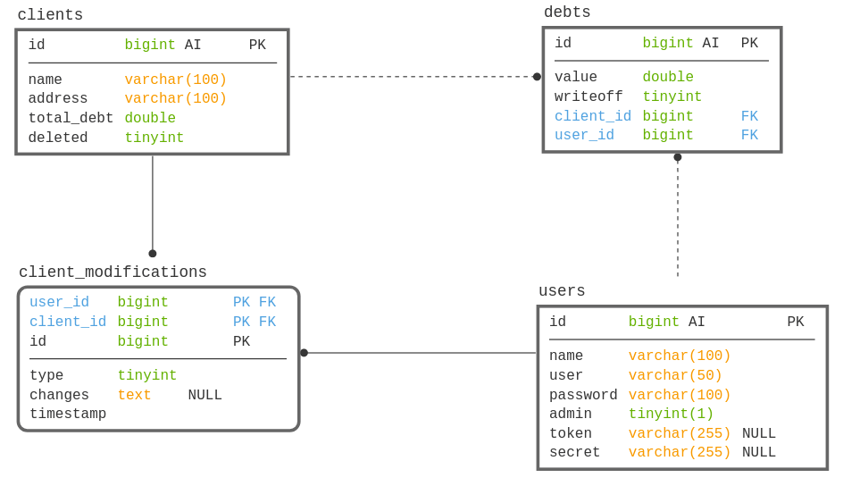

# API Contabilidade

## Sumário

* [Diagrama de banco de dados](#diagrama-de-banco-de-dados)
  * [Dicionário de dados](#dicionário-de-dados)
* [Autenticação](#autenticação)
* [Endpoints](#endpoints)
  * [Tabelas](#tabelas)
  * [Data-Flow](#data-flow)
  
A aplicação consiste em uma API para o controle de dados referentes a parte da contabilidade de um pequeno negócio, onde as necessidades são:
* Manter um cadastro de clientes e suas dividas;
* Controle de acesso de usuários com dois niveis (Administradores e outros usuários);
* Auditoria de modificação, criação e deleção de clientes e suas dívidas;

## Diagrama de banco de dados
[[voltar]](#sumário)


### Dicionário de dados
[[voltar]](#sumário)

* **Tabela _clients_**
  * **name** - Nome do cliente;
  * **address** - Endereço, pode ser cidade ou logradouro (a criterio do usuário);
  * **total_debt** - Dívida total, calculada a partir dos dados na tabela _debts_;
  * **deleted** - Flag de deleção lógica do cliente, mantido na persistencia para auditoria;
* **Tabela _client_modifications_**
  * **user_id** - Id do usuário responsável pela modificação 
  * **client_id** - Id do cliente modificado;
  * **type** - Tipo da modificação efetuada (CREATE = 0, UPDATE = 1, DELETE = 2);
  * **changes** - Campo utilizado para uma modificação do tipo UPDATE, onde é gravado um objeto JSON com a antiga e nova versão do cliente;  
* **Tabela _debts_**
  * **value** - Valor da dívida ou abate (Unsigned);
  * **writeoff** - Flag que indica se o valor é um abate(pagamento efetuado pelo cliente) ou uma dívida;
  * **client_id** - Id do cliente a quem pertence a dívida; 
  * **user_id** -  Id do usuário que cadastrou a dívida;
* **Tabela _users_**
  * **name** - Nome do usuário; 
  * **user** - Usuário de login;
  * **password** - Senha protegida por hash;
  * **admin** - Flag que indica se o usuário é um Administrador;
  * **token** - Token gerado pela API para comunicação segura com o usuário;
  * **secret** -  Segredo(senha) utilizada para verificar a autenticidade do token; 
  
## Autenticação
[[voltar]](#sumário)

A autenticação é feita por meio de tokens, os quais são gerados no login e enviado para o usuário, que deverá utilizar apenas o token para se comunicar com os endpoints protegidos. Ele possuí um tempo de expiração embutido, que para caso de testes está setado para um mês.
O token segue os padrões da [RFC 7519](https://tools.ietf.org/html/rfc7519) para JSON Web Tokens, ele é validado por meio de uma chave de 60 carácteres alfanuméricos, incluindo simbolos especiais, utilizada para checar a autenticidade do token.
Existem dois tipos de usuários no sistema _Administradores_ e _Outros_, todos os endpoints podem ser acessados pelo _Administrador_. _Outros_ são impedidos de utilizar os endpoints relaciodados ao CRUD de usuário e à auditoria de modificações do cliente. 

## Endpoints
[[voltar]](#sumário)

Todos os endpoints contém o prefixo _/api/v1_ que serão omitidos na tabela abaixo.

### Tabelas
[[voltar]](#sumário)

#### Users

| Método | URI | Usuário | Descrição | 
| :---: | :--- | :---: | :--- | 
| **POST** | [/user](#post-user) | Admin | Create user |
| **GET** | [/user/token](#get-usertoken) | - | Authenticate user |
| **GET** | [/user/{id}](#get-userid) | Admin | Read user |
| **GET** | [/user](#get-user) | Admin | Read all users |
| **PUT** | [/user/{id}](#put-userid) | Admin | Update user |
| **DELETE** | [/user/{id}](#delete-userid) | Admin | Delete user |

#### Clients

| Método | URI | Usuário | Descrição | 
| :---: | :--- | :---: | :---  |
| **POST** | [/client](#post-client) | Others | Create client |
| **GET** | [/client](#get-client-ou-clientdeleted-ou-clientnondeleted) | Others | Read all clients |
| **GET** | [/client/deleted](#get-client-ou-clientdeleted-ou-clientnondeleted) | Others | Read all deleted clients |
| **GET** | [/client/nondeleted](#get-client-ou-clientdeleted-ou-clientnondeleted) | Others | Read all non deleted clients |
| **GET** | [/client/{id}](#get-clientid) | Others | Read client |
| **GET** | [/client/{id}/modfications](#get-clientidmodifications) | Admin | Read all client modifications |
| **GET** | [/client/{id}/debts](#get-clientiddebts) | Other | Read all client debts |
| **PUT** | [/client/{id}](#put-clientid) | Other | Update client |
| **DELETE** | [/client/{id}](#delete-clientid) | Other | Delete client |

#### Debts

| Método | URI | Usuário | Descrição | 
| :---: | :--- | :---: | :---  |
| **POST** | [/debt](#post-debt) | Others | Create debt |
| **DELETE** | [/debt/{id}](#delete-debtid) | Admin | Delete debt |

[[voltar]](#sumário)
### Data-Flow

#### [POST] /user
[[voltar]](#users)

* Input esperado:
    * api_token - string;
    * name - string;
    * user - string;
    * admin - boolean (0 \| 1);
    * password - string;
* Output:
    * Status 201 - Created
    
#### [GET] /user/token
[[voltar]](#users)

* Input esperado:
    * user - string;
    * password - string;
* Output:
    * Status 401 - Unauthorized
    * Status 200 - OK
    ```JSON
    {
      "token":"API_TOKEN"  
    }    
    ```

#### [GET] /user/{id}
[[voltar]](#users)

* Input esperado:
    * api_token - string;
* Output:
    * Status 404 - Not Found
    * Status 200 - OK
    ```JSON
    {
        "id": 1,
        "name": "Administrator",
        "user": "admin",
        "admin": 1,
        "created_at": "2019-03-08 21:28:27",
        "updated_at": "2019-03-08 21:28:27"
    }  
    ```
    
#### [GET] /user
[[voltar]](#users)

* Input esperado:
    * api_token - string;
* Output:
    * Status 204 - No Content
    * Status 200 - OK
    ```JSON
    [  
        {
            "id": 1,
            "name": "Administrator",
            "user": "admin",
            "admin": 1,
            "created_at": "2019-03-08 21:28:27",
            "updated_at": "2019-03-08 21:28:27"
        }
    ]    
    ```
    
#### [PUT] /user/{id}
[[voltar]](#users)

* Input esperado:
    * api_token - string;
    * name - string
    * user - string
    * admin - boolean
    * old_password - string (Se este campo estiver vazio a senha não será alterada)
    * new_password - string
* Output:
    * Status 400 - Bad Request
    * Status 404 - Not Found
    * Status 204 - No Content 

#### [DELETE] /user/{id}
[[voltar]](#users)

* Input esperado:
    * api_token - string;
* Output:
    * Status 404 - Not Found
    * Status 204 - No Content 
    
#### [POST] /client
[[voltar]](#clients)

* Input esperado:
    * api_token - string;
    * name - string
    * address - string
* Output:
    * Status 201 - Created

#### [GET] /client ou /client/deleted ou /client/nondeleted
[[voltar]](#clients)

* Input esperado:
    * api_token - string;
* Output:
    * Status 204 - No Content
    * Status 200 - OK
    ```JSON
    [
        {
            "id": 1,
            "name": "Fulano",
            "address": "Cidade Tal",
            "total_debt": 0,
            "created_at": "2019-03-08 21:49:59",
            "updated_at": "2019-03-08 21:49:59"
        }
    ] 
    ```
    
#### [GET] /client/{id}
[[voltar]](#clients)

* Input esperado:
    * api_token - string;
* Output:
    * Status 404 - Not Found
    * Status 200 - OK
    ```JSON
    {
        "id": 1,
        "name": "Fulano",
        "address": "Cidade Tal",
        "total_debt": 0,
        "created_at": "2019-03-08 21:49:59",
        "updated_at": "2019-03-08 21:49:59"
    } 
    ```

#### [GET] /client/{id}/modifications
[[voltar]](#clients)

* Input esperado:
    * api_token - string;
* Output:
    * Status 204 - No Content
    * Status 200 - OK
    ```JSON
    [
        {
            "id": 5,
            "client_id": 1,
            "user_id": 1,
            "type": 0,
            "changes": null,
            "created_at": "2019-03-08 21:49:59",
            "updated_at": "2019-03-08 21:49:59"
        }
    ] 
    ```

#### [GET] /client/{id}/debts
[[voltar]](#clients)

* Input esperado:
    * api_token - string;
* Output:
    * Status 204 - No Content
    * Status 200 - OK
    ```JSON
    [
        {
            "id": 1,
            "value": 200,
            "writeoff": 0,
            "client_id": 1,
            "user_id": 1,
            "created_at": "2019-03-07 23:12:45",
            "updated_at": "2019-03-07 23:12:45"
        }
    ] 
    ```
 
#### [PUT] /client/{id}
[[voltar]](#clients)

* Input esperado:
    * api_token - string;
    * name - string
    * user - string
    * admin - boolean
    * old_password - string (Se este campo estiver vazio a senha não será alterada)
    * new_password - string
* Output:
    * Status 404 - Not Found
    * Status 204 - No Content 

#### [DELETE] /client/{id}
[[voltar]](#clients)

* Input esperado:
    * api_token - string;
* Output:
    * Status 404 - Not Found
    * Status 204 - No Content

#### [POST] /debt
[[voltar]](#debts)

* Input esperado:
    * api_token - string;
    * name - string;
    * user - string;
    * admin - boolean (0 \| 1);
    * password - string;
* Output:
    * Status 201 - Created

#### [DELETE] /debt/{id}
[[voltar]](#debts)

* Input esperado:
    * api_token - string;
    * value - double;
    * writeoff - boolean;
    * client_id - int;        
* Output:
    * Status 404 - Not Found
    * Status 204 - No Content
